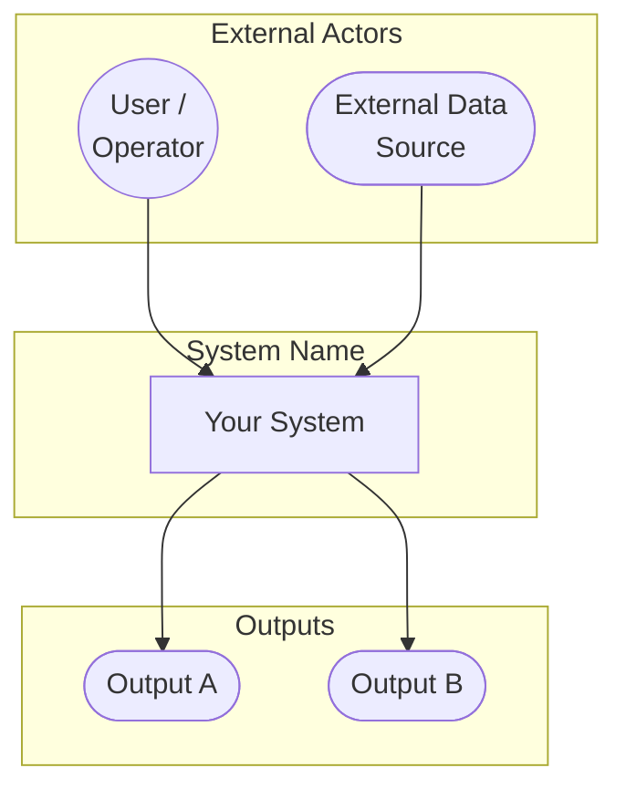
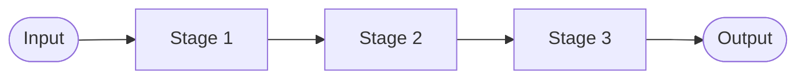
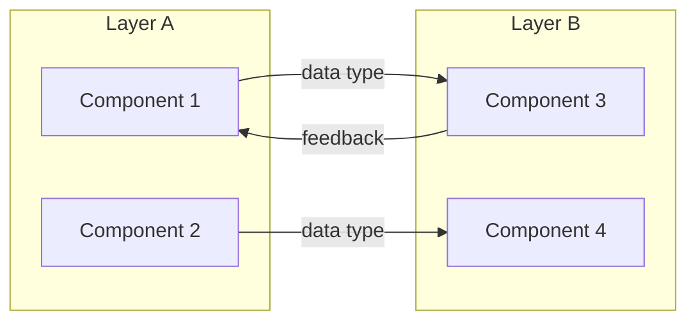
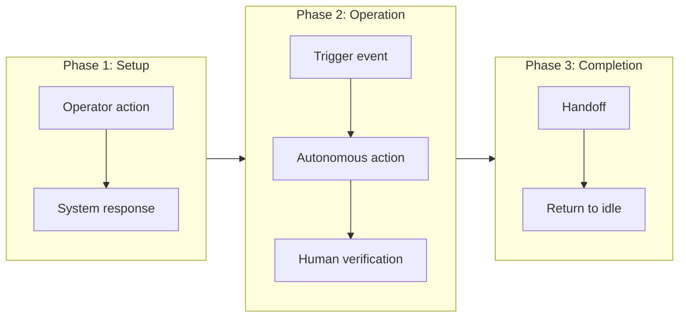
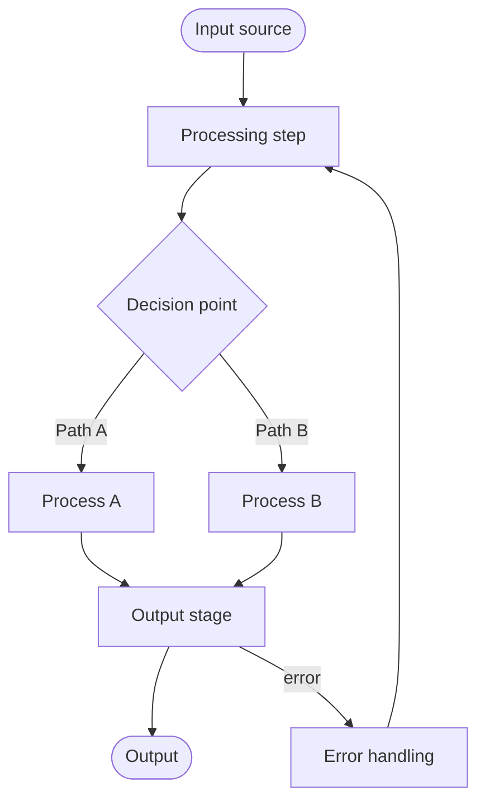
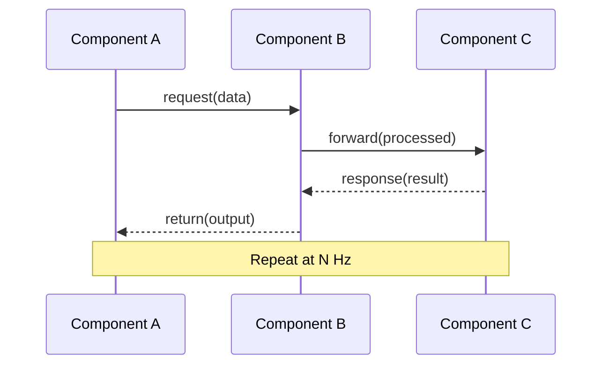
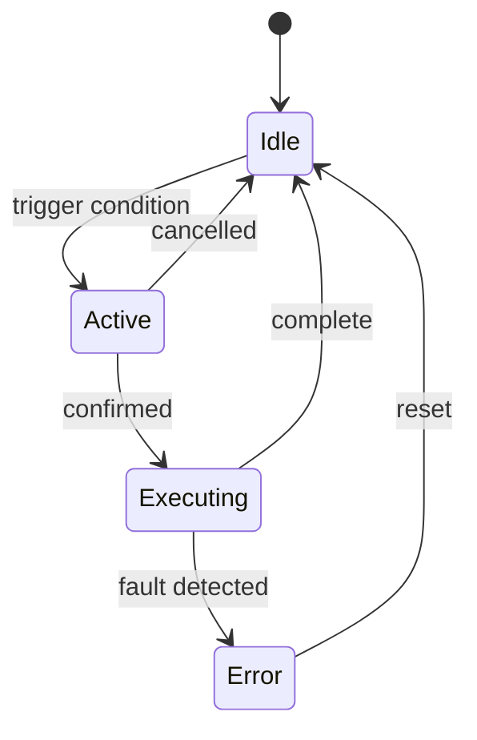
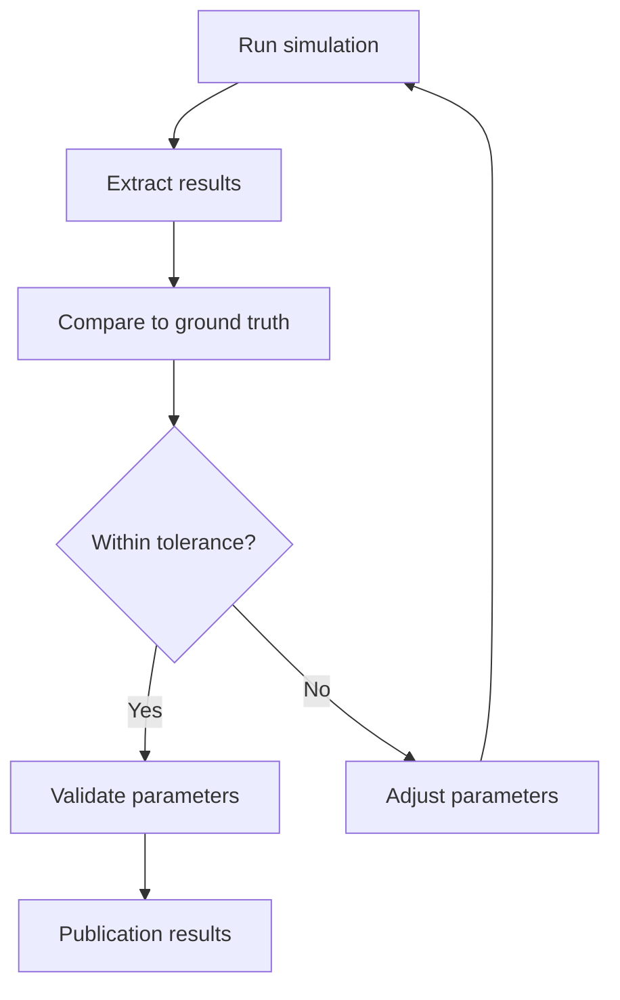
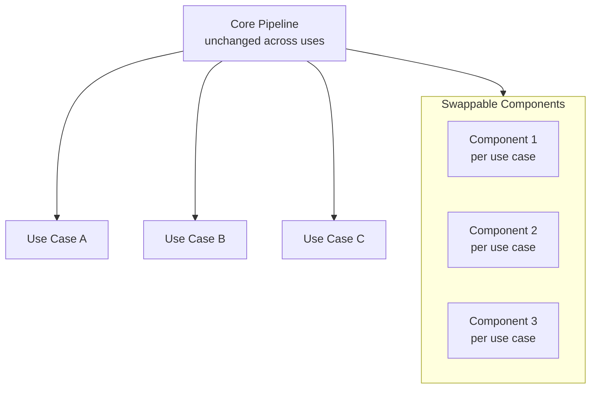

# -----------------PROJECT ARCHITECTURE.MD TEMPLATE-----------------------------

### Architecture.md Standard Structure
1. C4 Container Diagram
2. Concept of Operations (ConOps) [human-in-the-loop only]
3. Data Flow (detailed)
4. Sequence Diagram [complex interactions only]
5. State Machine [mode-based systems only]
6. Domain-Specific Diagram [rename per project]
7. Validation Pipeline [research/publication projects only]
8. Generalization Architecture [modular systems only]

---

### When to Use Each Diagram

| Diagram | Location | Use When | Skip When |
|---|---|---|---|
| C4 Context | README.md (always) | Every project | Never skip |
| Simplified Data Flow | README.md (optional) | Pipeline/simulation projects | Robot/hardware projects |
| C4 Container | architecture.md | Every project | Never skip |
| ConOps | architecture.md | Human-in-the-loop, medical robotics, safety-critical | Pure software pipelines, embedded firmware |
| Detailed Data Flow | architecture.md | Every project | Never skip |
| Sequence Diagram | architecture.md | Haptic loops, robot handoff sequences, ROS message chains, multi-component timed interactions | Simple pipelines, single-component systems |
| State Machine | architecture.md | Any system with distinct behavioral modes or states | Pure data pipelines with no mode switching |
| Validation Pipeline | architecture.md | Research projects targeting publication with quantitative results | Demos, tutorials, tooling |
| Generalization | architecture.md | Modularity is a core design claim | One-off projects, demos |

---

### Mermaid Templates

#### C4 Context (README.md)

#### Simplified Data Flow (README.md -- pipeline projects only)

#### C4 Container (architecture.md)

#### ConOps (architecture.md -- human-in-the-loop only)

#### Detailed Data Flow (architecture.md)

#### Sequence Diagram (architecture.md -- complex interactions only)

#### State Machine (architecture.md -- mode-based systems only)

#### Validation Pipeline (architecture.md -- research/publication only)

#### Generalization Architecture (architecture.md -- modular systems only)

---
